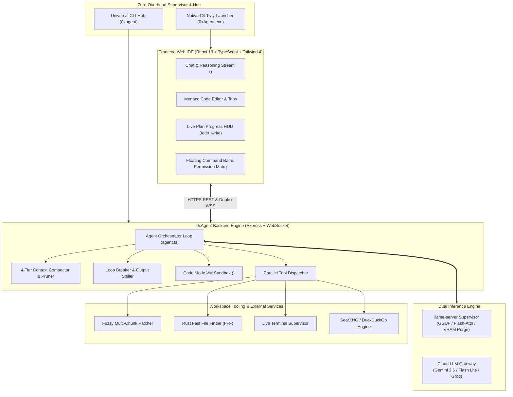

<div align="center">


# 0xAgent — Autonomous AI Developer & Web-IDE Platform

[](https://www.typescriptlang.org/)
[](https://react.dev/)
[](https://vitejs.dev/)
[](https://expressjs.com/)
[](https://github.com/ggerganov/llama.cpp)
[](LICENSE)

**Next-generation autonomous AI coding platform and Web-IDE with a built-in local inference engine (`llama.cpp`), full zero-config agent harness pipeline, and hybrid cloud fallback.**

[Quick Start](#-1-click-quick-start) • [CLI & Tray Hub](#-cli-supervisor--tray-hub) • [Features & Harness](#-key-features--agent-harness) • [Architecture](#-architecture) • [Configuration](#-configuration) • [License](#-license)

**[English](README.md)** • **[Русский](README.ru.md)**

</div>

---


---

## ⚡ 1-Click Quick Start

Install and configure 0xAgent in a single command. The installer automatically verifies prerequisites (Node.js LTS, Git), sets up SSL, builds the client, compiles the native Windows tray host, and binds the global `0xagent` CLI.

### Windows (PowerShell)
```powershell
irm https://raw.githubusercontent.com/T58574/0xAgent/main/install.ps1 | iex
```

### Linux / macOS / WSL (Bash)
```bash
curl -fsSL https://raw.githubusercontent.com/T58574/0xAgent/main/install.sh | bash
```

---

## 🎮 CLI Supervisor & Tray Hub

0xAgent runs quietly in your **System Tray** (`0xAgent.exe`, ~15 KB, ~8 MB RAM) without cluttering your terminal with open console windows, freeing 100% of GPU VRAM and CPU for inference.

Manage the entire platform from any terminal via the unified `0xagent` CLI:

```bash
# Launch platform in silent background Tray Mode (default)
0xagent

# Launch interactive CLI settings, API keys & models manager
0xagent config

# Pull latest releases & updates from GitHub with 1-click rebuild
0xagent update

# Inspect live backend health, port bindings & telemetry
0xagent status

# Veronica Personal AI Assistant CLI protocol
0xagent veronica context <project>    # Fetch dense token-efficient project context
0xagent veronica heartbeat --task <id> # Send alive signal & progress
0xagent veronica report --task <id>   # Finalize task and send Telegram alert
0xagent veronica git commit -m <msg>  # Safe unified git commit (L3+ autonomy)

# Probe remote GPU Compute Node on LAN workstation
0xagent node probe 192.168.1.100 11434

# Force purge GPU VRAM and terminate background inference workers
0xagent purge-vram

# Stop all background processes cleanly
0xagent stop
```

---

## 🚀 Key Features & Agent Harness

Unlike conventional wrappers requiring external servers (like Ollama or vLLM), **0xAgent is the first all-in-one platform featuring a native, built-in inference supervisor**, a 24/7 personal assistant module (**Veronica**), and a production-grade autonomous agent harness out of the box with zero complex setup.

### 🤖 Module «Veronica» — Personal AI Assistant & Telegram Supervisor
*See full guide: [docs/veronica.md](docs/veronica.md)*
- **Deterministic SQLite Audit Journal**: All background tasks, heartbeats, git commits, and project states are stored in an isolated `veronica.db` (WAL mode) with an In-Memory Single-Writer FIFO queue.
- **Telegram Bot Gateway (`grammy`)**: Control tasks, query project progress, and receive instant proactive notifications on completion, crashes, or timeouts (`/status`, `/projects`, `/today`, `/yesterday`, `/run`, `/kill`).
- **Unified Web-IDE Action Strip & Task Modal**: Launch background tasks with custom prompts, autonomy levels (L0–L5), and project binding directly from the Web-IDE interface.
- **Token-Dense Context Engine & 4-Phase Prompting**: Generates ultra-compact project summaries (~150-250 tokens) via `0xagent veronica context <project>` and injects project passports into headless tasks.
- **Watchdog & Process Supervisor**: Automatic PID verification, inactivity timeout tracking (300s), Tree-Kill of hanging subprocesses, and crash state self-healing on boot.
- **Single-Agent Project Mutex**: Exclusive project locks preventing race conditions and git corruption.
- **Autonomy Levels (L0–L5)**: Hardware-enforced privilege boundaries restricting automated git commits to L3+.

### 🧠 Dual Inference & Unified Model Selector
- **Unified Multi-Engine Model Selector**: Seamlessly switch between Antigravity Cloud models (Gemini 3.7/3.6/3.1 Pro, Claude Sonnet 4.6 & Opus Thinking, GPT-OSS 120B) and Local GGUF weights with inline reasoning effort toggles (`off`, `low`, `medium`, `high`).
- **24-Hour Persistent Model Caching**: High-performance `localStorage` cache with auto-invalidation and 1-click manual refresh.
- **24/7 Low-Power Laptop Mode**: Run 0xAgent and Veronica on a low-spec laptop 24/7 (~150 MB RAM) while offloading heavy LLM inference to a powerful GPU workstation over LAN (`0xagent node probe`).
- **Native `llama-server` Supervisor**: 1-click binary downloader and automatic GPU layer offloading (`-ngl`), Flash Attention (`-fa on`), quantized KV cache (`-ctk q8_0 -ctv q8_0`), and automated VRAM reclamation.
- **Local GGUF Model Hub**: Direct support for Qwen 2.5 Coder, Gemma 4, DeepSeek, and Llama 3.3.

### 🛠 Complete Zero-Config Agent Harness
- **Concurrent Tool Execution**: Read-only exploration tools (`read_file`, `list_dir`, `grep_search`, `fff_search`, `web_search`) execute in parallel via `Promise.all()`, speeding up repository scans by 3-5x.
- **Whitespace-Tolerant Patching (`patch_file`)**: Robust multi-chunk search/replace block patcher ensuring precise refactoring with zero data loss or file truncations.
- **Sandboxed Code Mode (`<code_run>`)**: In-memory VM runtime enabling the agent to execute complex Node.js automation scripts with async host tool bindings in a single turn.
- **Oscillation & Loop Breaker (`loopBreaker.ts`)**: 8-step rolling history tracking with canonical argument sorting, preventing repetitive tool cycling.
- **4-Tier Context Compaction (`compactionPipeline.ts`)**: Coordinated token optimization featuring zero-token tool pruning with error retention, CoT thought stripping, bounded windowing, and milestone summarization.
- **Output Spiller (`outputSpiller.ts`)**: Automatically offloads massive terminal outputs (>24 KB) to disk (`~/.0xagent/spill/*.log`) to shield the LLM context window.
- **Interactive Question Cards (`<ask_user_question>`)**: Agent can pause mid-flight to ask clarifying multi-choice questions or present interactive plan reviews.
- **Privacy Web Search & Fast File Finder**: Local SearXNG / DuckDuckGo web research with Markdown scrapers and sub-3ms Rust-accelerated file finder (`@ff-labs/fff-node`).

---

## 🏛 Architecture

### System Flow & Component Topology



### High-Level Topology Schema

```
┌────────────────────────────────────────────────────────────────────────┐
│                      0xAgent Web IDE Interface                         │
│       (React 19 + Vite 7 + Monaco Editor + Glassmorphism Theme)        │
└───────────────────────────────────┬────────────────────────────────────┘
                                    │ HTTPS REST & Duplex WSS
┌───────────────────────────────────▼────────────────────────────────────┐
│                    0xAgent Backend Engine & Harness                    │
│   ┌────────────────────────────────────────────────────────────────┐   │
│   │ Agent Loop • 4-Tier Context Compaction • Loop Breaker • Sandbox │   │
│   └───────────────────────────────┬────────────────────────────────┘   │
└───────────────────┬───────────────┴───────────────┬────────────────────┘
                    │                               │
┌───────────────────▼──────────────┐ ┌──────────────▼────────────────────┐
│  Built-in llama.cpp Supervisor   │ │      Hybrid Cloud Gateway         │
│  (Native GGUF / GPU Offloading)  │ │   (Google AI Studio / Groq API)   │
└──────────────────────────────────┘ └───────────────────────────────────┘
```

---

## 🌐 Localization

0xAgent provides full out-of-the-box bilingual support for **English** and **Russian (Русский)** across the entire interface, tool outputs, settings, and voice telemetry. Toggle instantly via the `[EN]` / `[RU]` badge in the navigation bar or configure via `0xagent config`.

- 📖 Документация на русском языке доступна в [README.ru.md](README.ru.md).

---

## 📁 Configuration

All runtime configurations, model weights, personas, and memory are stored in `~/.0xagent/`:

| Directory / File | Description |
|---|---|
| `~/.0xagent/config.json` | Global settings, API keys, active models, and security permissions |
| `~/.0xagent/veronica/` | Veronica SQLite audit journal (`veronica.db`), backups & task history |
| `~/.0xagent/models/` | Local GGUF model files repository |
| `~/.0xagent/llama/` | Managed `llama-server.exe` binary builds |
| `~/.0xagent/personas/` | System personas & memory (`SOUL.md`, `USER.md`, `TOOLS.md`) |
| `~/.0xagent/sessions/` | Dialogue session history and branching checkpoints |
| `~/.0xagent/workspaces/` | Isolated workspace sandbox directories |
| `~/.0xagent/spill/` | Disk spilled logs for outputs exceeding 24 KB |

---

## 📜 License

This project is licensed under the **MIT License**. See the [LICENSE](LICENSE) file for details.
