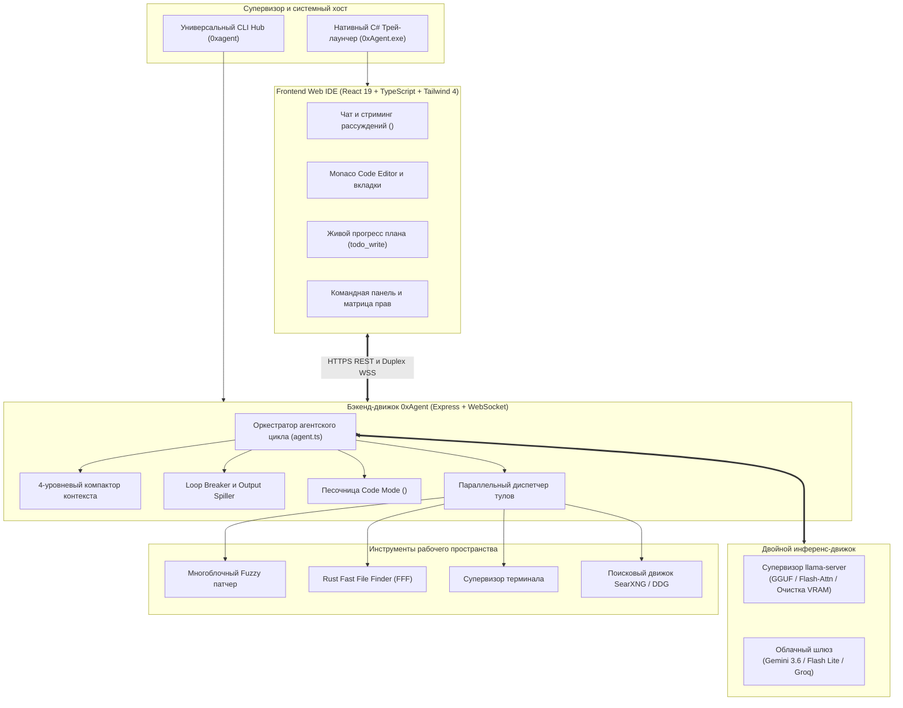

<div align="center">


# 0xAgent — Автономный AI-разработчик и Web-IDE платформа

[](https://www.typescriptlang.org/)
[](https://react.dev/)
[](https://vitejs.dev/)
[](https://expressjs.com/)
[](https://github.com/ggerganov/llama.cpp)
[](LICENSE)

**Автономная платформа для разработки и Web-IDE нового поколения со встроенным супервизором локальных моделей (`llama.cpp`), полным агентским harness-пайплайном без сложных настроек и гибридным облачным fallback.**

[Быстрый старт](#-быстрый-старт-в-1-клик) • [CLI и Трей](#-cli-супервизор-и-системный-трей) • [Возможности и Харнесс](#-ключевые-возможности-и-agent-harness) • [Архитектура](#-архитектура) • [Конфигурация](#-конфигурация) • [Лицензия](#-лицензия)

**[English](README.md)** • **[Русский](README.ru.md)**

</div>

---


---

## ⚡ Быстрый старт в 1 клик

Установка и первоначальная настройка 0xAgent в одну строку. Установщик автоматически проверит наличие Node.js и Git, сгенерирует SSL-сертификаты, соберет клиент, скомпилирует нативный C# трей-лаунчер и настроит глобальную команду `0xagent`.

### Windows (PowerShell)
```powershell
irm https://raw.githubusercontent.com/T58574/0xAgent/main/install.ps1 | iex
```

### Linux / macOS / WSL (Bash)
```bash
curl -fsSL https://raw.githubusercontent.com/T58574/0xAgent/main/install.sh | bash
```

---

## 🎮 CLI супервизор и системный трей

0xAgent работает в фоновом режиме в **системном трее Windows** (`0xAgent.exe`, ~15 КБ, ~8 МБ RAM) без висящих окон терминала, сохраняя 100% ресурсов GPU VRAM и CPU для инференса нейросетей.

Управление платформой осуществляется из любой консоли через единую утилиту `0xagent`:

```bash
# Запуск платформы в тихом фоновом режиме в системном трее (по умолчанию)
0xagent

# Интерактивное меню настроек, ключей API и каталога GGUF моделей
0xagent config

# Проверка и установка обновлений из GitHub с автоматической пересборкой
0xagent update

# Проверка здоровья бэкенда, портов и телеметрии
0xagent status

# CLI-протокол персонального AI-ассистента «Вероника»
0xagent veronica context <project>    # Получить плотный контекст проекта (<250 токенов)
0xagent veronica heartbeat --task <id> # Отправить сигнал жизни и прогресс
0xagent veronica report --task <id>   # Финализировать задачу и отправить отчет в Telegram
0xagent veronica git commit -m <msg>  # Безопасный коммит от имени задачи (L3+ автономность)

# Проверка доступности удаленного GPU-узла в локальной сети
0xagent node probe 192.168.1.100 11434

# Принудительная очистка GPU VRAM и завершение инференс-воркеров
0xagent purge-vram

# Корректная остановка всех фоновых процессов платформы
0xagent stop
```

---

## 🚀 Ключевые возможности и Agent Harness

В отличие от классических решений, требующих установки и ручного запуска сторонних серверов (вроде Ollama или vLLM), **0xAgent — первая в своем роде платформа со встроенным движком инференса**, модулем персонального ассистента 24/7 (**«Вероника»**) и готовым автономным агентским пайплайном из коробки.

### 🤖 Модуль «Вероника» — Персональный AI-ассистент и Telegram-супервизор
*См. подробное руководство: [docs/veronica.ru.md](docs/veronica.ru.md)*
- **Детерминированный SQLite операционный журнал**: Все фоновые задачи, сигналы жизни, коммиты и состояния проектов фиксируются в изолированной базе `veronica.db` (режим WAL) с In-Memory Single-Writer FIFO очередью записи.
- **Telegram Бот (`grammy`)**: Управление задачами, запрос статуса проектов и мгновенные проактивные алерты о завершении, падениях или таймаутах (`/status`, `/projects`, `/today`, `/yesterday`, `/run`, `/kill`).
- **Сверхплотный Context Engine**: Синтезирует компактные выжимки состояния проектов (~150-250 токенов) через команду `0xagent veronica context <project>`, не забивая контекстное окно агентов.
- **Watchdog и супервизор процессов**: Мониторинг PID в ОС, контроль таймаута активности (300с), древовидное завершение зависших подпроцессов (Tree-Kill) и авто-восстановление задач при старте.
- **Мьютекс на проект**: Эксклюзивная блокировка проекта для одной активной задачи, исключающая гонки и повреждение git.
- **Уровни автономности (L0–L5)**: Аппаратное разграничение прав, разрешающее автоматические git-коммиты только с уровня L3+.

### 🧠 Распределенный узел инференса в LAN и локальный Llama-движок
- **Режим 24/7 на легковесном ноутбуке**: Запуск 0xAgent и Вероники круглосуточно на слабом ноутбуке (~150 МБ RAM) с делегированием тяжелого инференса на мощную GPU рабочую станцию в локальной сети (`0xagent node probe`).
- **Нативный супервизор `llama-server`**: Загрузка бинарников в 1 клик, автоматический оффлоад слоев на GPU (`-ngl`), Flash Attention (`-fa on`), квантованный KV-кэш (`-ctk q8_0 -ctv q8_0`) и автоматическое освобождение видеопамяти при переключении моделей.
- **Локальный хаб GGUF-моделей**: Прямая поддержка моделей семейств Qwen 2.5 Coder, Gemma 4, DeepSeek и Llama 3.3.

### 🛠 Полный Zero-Config Agent Harness
- **Параллельное исполнение инструментов**: Инструменты чтения (`read_file`, `list_dir`, `grep_search`, `fff_search`, `web_search`) выполняются конкурентно через `Promise.all()`, ускоряя исследование репозитория в 3-5 раз.
- **Нечеткий патчинг кода (`patch_file`)**: Устойчивый к пробелам многоблочный поисково-заменяющий патчер, обеспечивающий точный рефакторинг без усечения файлов и потери данных.
- **Песочница Code Mode (`<code_run>`)**: Изолированная VM-среда Node.js, позволяющая агенту выполнять комплексные скрипты автоматизации с асинхронными методами `tools.*` за один такт без раздувания токенов.
- **Защита от циклов и осцилляций (`loopBreaker.ts`)**: Отслеживание скользящей истории вызовов с канонической сортировкой аргументов для предотвращения зацикливания агента.
- **4-уровневое сжатие контекста (`compactionPipeline.ts`)**: Скоординированная оптимизация токенов: отсечение старых выводов тулов с сохранением ошибок, стриппинг CoT-размышлений, скользящее окно и суммаризация при заполнении 75% окна.
- **Output Spiller (`outputSpiller.ts`)**: Автоматический сброс больших выводов команд (>24 КБ) на диск (`~/.0xagent/spill/*.log`) для защиты контекста модели.
- **Интерактивные диалоговые карточки (`<ask_user_question>`)**: Возможность для агента запросить уточнение или предоставить карточки выбора вариантов и ревью плана.
- **Приватный веб-поиск и скоростной файловый индекс**: Встроенный локальный поиск SearXNG / DuckDuckGo со скрейпером Markdown и нативный быстрый поиск файлов FFF на Rust (`@ff-labs/fff-node`, <3 мс).

---

## 🏛 Архитектура

### Схема потоков данных и компонентов



### Высокоуровневая топология системы

```
┌────────────────────────────────────────────────────────────────────────┐
│                      0xAgent Web IDE Interface                         │
│       (React 19 + Vite 7 + Monaco Editor + Glassmorphism Theme)        │
└───────────────────────────────────┬────────────────────────────────────┘
                                    │ HTTPS REST & Duplex WSS
┌───────────────────────────────────▼────────────────────────────────────┐
│                    0xAgent Backend Engine & Harness                    │
│   ┌────────────────────────────────────────────────────────────────┐   │
│   │ Agent Loop • 4-Tier Context Compaction • Loop Breaker • Sandbox │   │
│   └───────────────────────────────┬────────────────────────────────┘   │
└───────────────────┬───────────────┴───────────────┬────────────────────┘
                    │                               │
┌───────────────────▼──────────────┐ ┌──────────────▼────────────────────┐
│  Встроенный супервизор llama.cpp │ │      Гибридный облачный шлюз      │
│  (Нативный GGUF / GPU Offload)   │ │   (Google AI Studio / Groq API)   │
└──────────────────────────────────┘ └───────────────────────────────────┘
```

---

## 🌐 Локализация

0xAgent полностью поддерживает **английский** и **русский** языки интерфейса, карточек инструментов, голосового ассистента и настроек. Переключение осуществляется в 1 клик через значок `[EN]` / `[RU]` в навигационной панели либо командой `0xagent config`.

---

## 📁 Конфигурация

Все пользовательские настройки, веса моделей, профили и сессии хранятся в каталоге `~/.0xagent/`:

| Путь | Назначение |
|---|---|
| `~/.0xagent/config.json` | Глобальные настройки, ключи API, активные модели и пресеты безопасности |
| `~/.0xagent/veronica/` | Операционный SQLite журнал Вероники (`veronica.db`), бэкапы и задачи |
| `~/.0xagent/models/` | Каталог локальных весов моделей формата GGUF |
| `~/.0xagent/llama/` | Управляемые бинарные сборки `llama-server.exe` |
| `~/.0xagent/personas/` | Системные персоны и память (`SOUL.md`, `USER.md`, `TOOLS.md`) |
| `~/.0xagent/sessions/` | История диалогов и точки ветвления сессий |
| `~/.0xagent/workspaces/` | Изолированные песочницы рабочих пространств |
| `~/.0xagent/spill/` | Логи больших выводов инструментов (>24 КБ) |

---

## 📜 Лицензия

Проект распространяется под свободной лицензией **MIT License**. См. подробности в файле [LICENSE](LICENSE).
