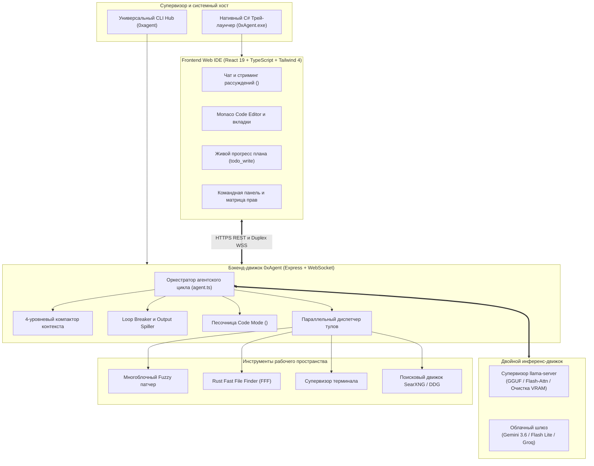

<div align="center">


# 0xAgent — Автономный AI-разработчик и Web-IDE платформа

[](https://www.typescriptlang.org/)
[](https://react.dev/)
[](https://vitejs.dev/)
[](https://expressjs.com/)
[](https://github.com/ggerganov/llama.cpp)
[](tests/)
[](LICENSE)

**Автономная платформа для разработки и Web-IDE нового поколения со встроенным супервизором локальных моделей (`llama.cpp`), полным агентским harness-пайплайном без сложных настроек и гибридным облачным fallback.**

[Быстрый старт](#-быстрый-старт-в-1-клик) • [Терминальный CUI](#-терминальный-cui-и-консольный-ai-агент) • [Ключевые возможности](#-ключевые-возможности-и-agent-harness) • [Архитектура](#-архитектура) • [Конфигурация](#-конфигурация) • [Лицензия](#-лицензия)

**[English](README.md)** • **[Русский](README.ru.md)**

</div>

---


---

## ⚡ Быстрый старт в 1 клик

Установка и первоначальная настройка 0xAgent в одну строку. Установщик автоматически проверит наличие Node.js и Git, сгенерирует SSL-сертификаты, соберет клиент, скомпилирует нативный C# трей-лаунчер и настроит глобальную команду `0xagent`.

### Windows (PowerShell)
```powershell
irm https://raw.githubusercontent.com/T58574/0xAgent/main/install.ps1 | iex
```

### Linux / macOS / WSL (Bash)
```bash
curl -fsSL https://raw.githubusercontent.com/T58574/0xAgent/main/install.sh | bash
```

---

## 🎮 Терминальный CUI и консольный AI-агент

0xAgent предоставляет полноценный, визуально богатый **терминальный CUI (Character User Interface)** и консольный раннер (в стиле Claude Code, Antigravity CLI, Codex CLI и OpenCode CLI), который можно вызывать из **любой рабочей директории** или использовать для автоматизации через скрипты и Веронику:

```bash
# Запуск интерактивной CUI REPL-сессии в текущей директории:
0xagent

# Интерактивное TUI настроек (переключение Auto Open Browser, прав, тем и т.д.):
0xagent settings

# Интерактивное TUI выбора моделей (с горизонтальным слайдером reasoning effort):
0xagent model

# Интерактивный переключатель персон:
0xagent persona

# Однократное выполнение задачи прямо в консоли текущей папки:
0xagent "Проанализируй проект и предложи архитектурные улучшения"
0xagent -p "Исправь ошибки типов в server/agent.ts"

# Тихий режим для скриптов, пайпов и headless-автоматизации (CI / фоновые задачи):
0xagent -p "Сделай краткое резюме git diff" --quiet
git diff | 0xagent "Объясни изменения в этом diff"

# Управление локальным LLM-сервером (llama-server):
0xagent server status
0xagent server start
0xagent server stop
0xagent server logs
0xagent server purge

# Просмотр и редактирование конфигурации:
0xagent config show
0xagent config set permission_preset unrestricted
0xagent config set auto_open_browser true

# Супервизор сервисов:
0xagent start           # Запуск в тихом фоновом системном трее Windows
0xagent status          # Проверка здоровья бэкенда и телеметрии
0xagent purge-vram      # Принудительная очистка видеопамяти GPU
0xagent update          # Обновление из GitHub и пересборка
0xagent stop            # Остановка всех запущенных процессов
```

### ⌨️ Слэш-команды CUI и интерактивные модальные окна

В режиме `0xagent` введите `/` для открытия меню команд или используйте слэш-команды напрямую:

| Слэш-команда | Описание |
|---|---|
| `/settings` | Открыть интерактивную двухколоночную таблицу настроек с живым поиском (`Auto Open Browser`, `Permission Preset`, `Reasoning Effort`, `Theme` и др.) |
| `/model` | Открыть селектор моделей с горизонтальным **слайдером усилий размышлений** (`low` / `medium` / `high` / `auto`), сканированием локальных GGUF и облачными LLM |
| `/persona` | Открыть интерактивное меню переключения профилей персон |
| `/server [действие]` | Управление локальным `llama-server` (`start`, `stop`, `status`, `logs`, `purge`) |
| `/status` | Просмотр данных оборудования, потребления VRAM GPU и телеметрии активной сессии |
| `/compact` | Принудительный запуск 4-уровневого сжатия контекста и очистки токенов |
| `/config [ключ] [знач]` | Быстрый просмотр или обновление параметра конфигурации |
| `/clear`, `/reset` | Очистка истории диалога и сброс чекпоинта контекста |
| `/help` | Отображение справочника команд и горячих клавиш |
| `/exit`, `/quit` | Выход из терминальной сессии CUI |

> [!TIP]
> **Никаких всплывающих окон браузера при старте**: По умолчанию параметр `auto_open_browser` отключен (`false`). Запуск 0xAgent никогда не прерывает работу внезапным открытием вкладки в браузере. Вы можете включить автоматическое открытие в любой момент через `/settings`, настройки Web-IDE или командой `0xagent config set auto_open_browser true`.

---

## 🚀 Ключевые возможности и Agent Harness

В отличие от классических оберток, требующих внешних серверов (вроде Ollama или vLLM), **0xAgent — первая автономная среда со встроенным супервизором инференса**, автономным Telegram-ботом, персистентным движком памяти SQLite и полноценным производственным Agent Harness «из коробки» без сложной настройки.

### 📱 Автономный Telegram-бот
- **Прямой запрос к локальной модели**: Построен на фреймворке GrammY и связывается напрямую с локальным `llama-server` (`127.0.0.1:11434`), гарантируя 100% приватность без отправки данных в облако.
- **Аппаратный белый список пользователей (Whitelist)**: Строгая фильтрация по Telegram ID (`telegram.whitelist`), гарантирующая доступ только вашему авторизованному аккаунту.
- **Многошаговый контекст и умный сплиттинг**: Поддерживает историю диалога с автоматическим контролем переполнения и конвертирует Markdown в чистые Telegram HTML-карточки с подсветкой синтаксиса, цитатами и безопасным разбиением длинных сообщений (<4096 символов).
- **Встроенные команды**: `/start`, `/help`, `/status` (проверка состояния сервера и модели), `/model` (активная нейросеть), `/reset`, `/clear` (очистка контекста).

### 🧠 Движок памяти Memory Engine v1.0 и архитектура Scoped SQLite
- **Нативное хранилище SQLite WAL**: Все воспоминания, аудит и эпизоды сохраняются в `~/.0xagent/memory.db` со скоростью нативного `node:sqlite` и полнотекстовым индексом FTS5.
- **Разделение глобальных и проектных контекстов**: Физическая изоляция глобальных предпочтений пользователя от проектных знаний (`project_id`) с автоматическим разрешением псевдонимов путей.
- **Динамический распределитель токен-бюджета**: Интеллектуальное динамическое выделение памяти (0..400 токенов) — при обычном общении память не подмешивается (0 токенов), сохраняя максимальную пропускную способность KV-кэша.
- **Затухание памяти и разрешение конфликтов**: Автоматическое затухание уверенности (confidence decay) со временем, архивация устаревших фактов (< 0.1) и детерминированное замещение дубликатов.
- **Динамический компилятор USER.md**: Автоматическая компиляция актуальных предпочтений пользователя напрямую в системный промпт без ручного редактирования файлов.

### ⚡ Двойной инференс и единый хаб моделей
- **Нативный супервизор `llama-server`**: Загрузка бинарников в 1 клик, автоматический оффлоад слоев на GPU (`-ngl`), Flash Attention (`-fa on`), квантованный KV-кэш (`-ctk q8_0 -ctv q8_0`) и автоматическое освобождение видеопамяти при простое или переключении на облако.
- **Локальный хаб GGUF-моделей**: Прямая поддержка моделей семейств Qwen 2.5 Coder, Gemma 4, DeepSeek и Llama 3.3.
- **Гибридный облачный Fallback**: Мгновенное переключение на Google AI Studio (Gemini 3.7/3.6/3.1 Pro, Flash Lite) с инлайн-настройкой усилий рассуждений (`off`, `low`, `medium`, `high`).
- **Режим удаленной рабочей станции (LAN)**: Запуск легковесного Web IDE / CUI на ноутбуке (~150 МБ RAM) с делегированием тяжелого инференса на мощный GPU-компьютер в локальной сети.

### 🛠 Полный Zero-Config Agent Harness
- **Параллельное исполнение инструментов**: Инструменты чтения (`read_file`, `list_dir`, `grep_search`, `fff_search`, `web_search`) выполняются параллельно через `Promise.all()`, ускоряя исследование репозитория в 3-5 раз.
- **Устойчивый к пробелам патчер (`patch_file`)**: Надежный многоблочный поисково-заменяющий патчер, обеспечивающий точный рефакторинг без усечения файлов и потери данных.
- **Песочница Code Mode (`<code_run>`)**: Изолированная VM-среда Node.js, позволяющая агенту выполнять комплексные скрипты автоматизации с асинхронными методами `tools.*` за один такт.
- **Двухуровневый протокол подтверждений**: Неблокирующие подсказки действий (`<quick_replies>`) и криптографический затвор (`<request_approval>`) с валидацией SHA-256 для деструктивных операций.
- **Самоулучшение и Staged Proposals (`selfPatchEngine.ts`)**: Попытки модификации ядра агента автоматически перехватываются, изолируются в staged proposals и могут быть безопасно проверены, применены или откатаны.
- **Защита от циклов и осцилляций (`loopBreaker.ts`)**: Отслеживание 8-шаговой скользящей истории вызовов с канонической сортировкой аргументов для предотвращения зацикливания агента.
- **4-уровневое сжатие контекста (`compactionPipeline.ts`)**: Координированная оптимизация токенов: отсечение старых выводов тулов с сохранением ошибок, стриппинг CoT-размышлений, скользящее окно и суммаризация ключевых этапов.
- **Output Spiller (`outputSpiller.ts`)**: Автоматический сброс больших выводов команд (>24 КБ) на диск (`~/.0xagent/spill/*.log`) для защиты контекстного окна LLM.
- **Приватный веб-поиск и скоростной файловый индекс**: Встроенный локальный поиск SearXNG / DuckDuckGo со скрейпером Markdown и нативный быстрый поиск файлов FFF на Rust (`@ff-labs/fff-node`, <3 мс).

---

## 🏛 Архитектура

### Схема потоков данных и компонентов


```mermaid
flowchart TD
    subgraph UI ["Frontend Web IDE (React 19 + TypeScript + Tailwind 4)"]
        Chat["Чат и стриминг рассуждений (<think>)"]
        Editor["Monaco Code Editor и вкладки"]
        PlanHUD["Живой прогресс плана (todo_write)"]
        CmdBar["Командная панель и матрица прав"]
    end

    subgraph Host ["Супервизор и системный хост"]
        Tray["Нативный C# Трей-лаунчер (0xAgent.exe)"]
        CLI["Универсальный CLI Hub (0xagent)"]
    end

    subgraph Core ["Бэкенд-движок 0xAgent (Express + WebSocket)"]
        AgentLoop["Оркестратор агентского цикла (agent.ts)"]
        Compactor["4-уровневый компактор контекста"]
        LoopGuard["Loop Breaker и Output Spiller"]
        Sandbox["Песочница Code Mode (<code_run>)"]
        Dispatcher["Параллельный диспетчер тулов"]
    end

    subgraph Inference ["Двойной инференс-движок"]
        LlamaSup["Супервизор llama-server\n(GGUF / Flash-Attn / Очистка VRAM)"]
        CloudAPI["Облачный шлюз\n(Gemini 3.6 / Flash Lite / Groq)"]
    end

    subgraph Tooling ["Инструменты рабочего пространства"]
        FilePatcher["Многоблочный Fuzzy патчер"]
        FFF["Rust Fast File Finder (FFF)"]
        Terminal["Супервизор терминала"]
        Search["Поисковый движок SearXNG / DDG"]
    end

    Tray --> UI
    CLI --> Core
    UI <===>|"HTTPS REST и Duplex WSS"| Core
    Core --> AgentLoop
    AgentLoop --> Compactor
    AgentLoop --> LoopGuard
    AgentLoop --> Sandbox
    AgentLoop --> Dispatcher
    Dispatcher --> FilePatcher
    Dispatcher --> FFF
    Dispatcher --> Terminal
    Dispatcher --> Search
    AgentLoop <===> Inference
    Inference --- LlamaSup
    Inference --- CloudAPI
```

### Высокоуровневая топология системы

```
┌────────────────────────────────────────────────────────────────────────┐
│                      0xAgent Web IDE Interface                         │
│       (React 19 + Vite 7 + Monaco Editor + Glassmorphism Theme)        │
└───────────────────────────────────┬────────────────────────────────────┘
                                    │ HTTPS REST & Duplex WSS
┌───────────────────────────────────▼────────────────────────────────────┐
│                    0xAgent Backend Engine & Harness                    │
│   ┌────────────────────────────────────────────────────────────────┐   │
│   │ Agent Loop • 4-Tier Context Compaction • Loop Breaker • Sandbox │   │
│   └───────────────────────────────┬────────────────────────────────┘   │
└───────────────────┬───────────────┴───────────────┬────────────────────┘
                    │                               │
┌───────────────────▼──────────────┐ ┌──────────────▼────────────────────┐
│  Встроенный супервизор llama.cpp │ │      Гибридный облачный шлюз      │
│  (Нативный GGUF / GPU Offload)   │ │   (Google AI Studio / Groq API)   │
└──────────────────────────────────┘ └───────────────────────────────────┘
```

---

## 🌐 Локализация

0xAgent полностью поддерживает **английский** и **русский** языки интерфейса, карточек инструментов, голосового ассистента и настроек. Переключение осуществляется в 1 клик через значок `[EN]` / `[RU]` в навигационной панели либо командой `0xagent config`.

---

## 📁 Конфигурация

Все пользовательские настройки, веса моделей, профили и сессии хранятся в каталоге `~/.0xagent/`:

| Путь | Назначение |
|---|---|
| `~/.0xagent/config.json` | Глобальные настройки, ключи API, активные модели, прокси и профили безопасности |
| `~/.0xagent/memory.db` | База данных долгосрочной памяти SQLite (режим WAL: воспоминания, эпизоды, связи, FTS5) |
| `~/.0xagent/certs/` | Локальный центр сертификации CA и SSL-сертификаты для защищенного HTTPS / WSS |
| `~/.0xagent/models/` | Каталог локальных весов моделей формата GGUF |
| `~/.0xagent/llama/` | Управляемые бинарные сборки `llama-server.exe` |
| `~/.0xagent/personas/` | Системные персоны и память (`SOUL.md`, `USER.md`, `TOOLS.md`) |
| `~/.0xagent/sessions/` | История диалогов и точки ветвления сессий |
| `~/.0xagent/workspaces/` | Изолированные песочницы рабочих пространств |
| `~/.0xagent/spill/` | Логи больших выводов инструментов (>24 КБ) |

---

## 📜 Лицензия

Проект распространяется под свободной лицензией **MIT License**. См. подробности в файле [LICENSE](LICENSE).
