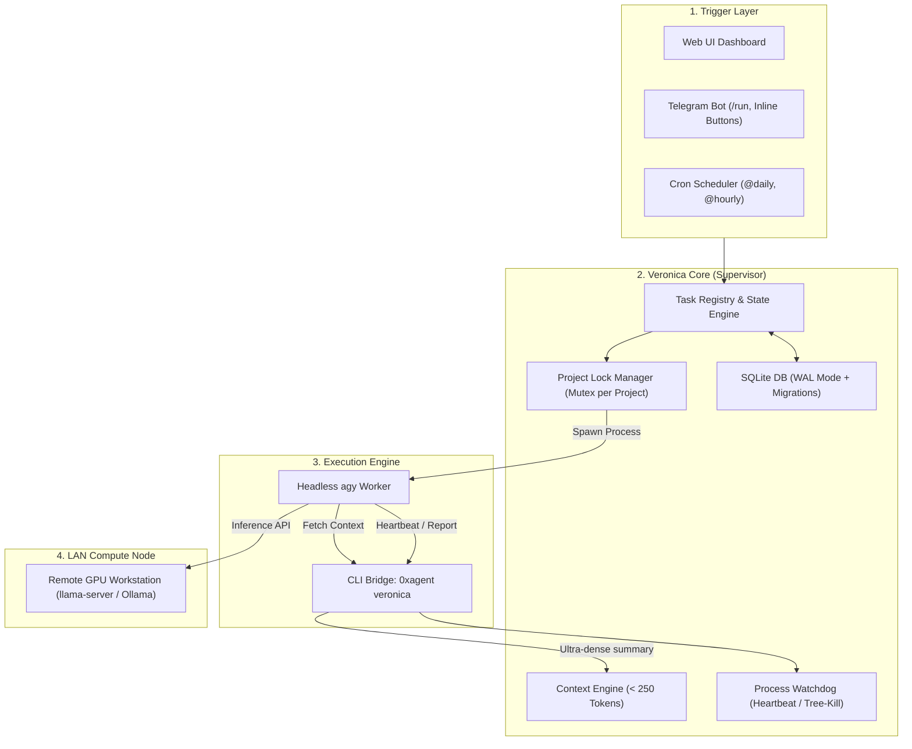

# Module «Veronica» (Вероника) — Autonomous AI Assistant & Supervised Agent Orchestrator

## 🚀 Overview
**Module Veronica** is a 24/7 autonomous background AI supervisor, persistent state machine, and agent orchestrator built into the **0xAgent** platform. It acts as an executive command center that monitors projects, coordinates headless agents (`agy`), enforces safety constraints, manages LAN GPU inference delegation, and connects directly to Telegram.

---

## 🏛 Architecture & Key Subsystems



---

## 🔑 Key Capabilities

### 1. Headless Agent Spawner (`agy`)
* **Verified CLI Flags**:
  ```bash
  agy --print "<prompt>" --dangerously-skip-permissions --output-format json --project "<project>"
  ```
* **Environment Variable Injection**:
  - `VERONICA_TASK_ID`: Unique UUID of active task.
  - `VERONICA_TASK_TOKEN`: Cryptographic single-use nonce.
  - `VERONICA_PROJECT`: Bound project name.
  - `VERONICA_API_URL`: Local REST bridge endpoint.

### 2. Dense Context Engine (< 250 Tokens)
* Instead of re-reading massive project directories, agents query Veronica:
  ```bash
  0xagent veronica context <project> --task <id>
  ```
* Produces ultra-compact token-efficient state:
  `PROJECT:0xAgent | AUTONOMY:L2 | RECENT_TASKS:[health_check:completed] | COMMITS:[b0be1d6:"fix telegram"] | RULES:keep_minimal`

### 3. Telegram Gateway & Awaiting Approval
* **Safe HTML Mode**: Full support for Telegram Bot API formatting (`parse_mode: 'HTML'`) with automatic entity escaping.
* **Commands**:
  - `/start`, `/help` — Overview and display caller's Telegram ID.
  - `/status` — System telemetry, active tasks, remote GPU node status.
  - `/projects` — Project summaries and active counts.
  - `/today`, `/yesterday` — Chronological daily activity audit.
  - `/run <skill> <project>` — Spawn autonomous agent task.
  - `/kill <task_id>` — Force kill stuck agent.
* **Interactive Inline Approval**:
  - In `awaiting_approval` state, bot renders `[✅ Approve]` and `[❌ Reject]` buttons.
  - Callback queries unblock execution instantly upon user click.

### 4. 10 Built-In Production Skills (`server/veronica/skills/`)

| Skill File | Purpose |
|---|---|
| `code_review.md` | Automated code quality, type-safety, and style review. |
| `security_audit.md` | Scans for SQLi, XSS, RCE, secret leaks, and dependency advisories. |
| `health_check.md` | Verifies build compilation and 100% test pass rate. |
| `git_sync.md` | Safe branch synchronization and commit tracking. |
| `architecture_audit.md` | Deep modularity analysis and circular dependency check. |
| `refactoring.md` | Eliminates dead code and duplication under strict test validation. |
| `test_generator.md` | Generates complete unit/integration tests with edge cases. |
| `doc_sync.md` | Synchronizes English and Russian documentation in 1-to-1 parity. |
| `dependency_updater.md` | Safe minor/patch npm package updates without regressions. |
| `incident_responder.md` | Crash diagnosis, stacktrace analysis, and remediation patches. |

### 5. Remote Compute Node (LAN Workstation Offloading)
* Allows a lightweight laptop to run 24/7 with minimal power draw while delegating heavy LLM token generation to a LAN PC with a dedicated GPU.
* Configurable under **Settings -> Local Server -> Compute Node (LAN)**.

### 6. Antigravity Ecosystem Integration & Model Selector
* **Antigravity CLI Engine (`agy`)**: Seamless execution of autonomous agents and multi-turn chat sessions with automated parameter validation.
* **Intelligent Effort & Model Resolver (`resolveAntigravityModelAndEffort`)**:
  - `gemini-3.7-flash` & `gemini-3.6-flash`: Configurable effort (`low` [default], `medium`, `high`).
  - `gemini-3.1-pro`: Configurable effort (`low` [default], `high`).
  - `claude-sonnet-4-6` & `claude-opus-4-6-thinking`: Automatic `--effort` stripping (native integrated thinking).
  - `gpt-oss-120b-medium`: Fixed medium reasoning (no `--effort` flag).
  - Local GGUF models (`llama.cpp`): Inline reasoning effort (`off`, `low`, `medium`, `high`).
* **Direct Process Spawning**: Safe binary execution using `getSafeCliPath` and `shell: false` (eliminates Node.js `DEP0190` security warnings).
* **Specialized Subagents**: Native support for specialized background personas (`critic`, `research`, `layout-qa-accessibility`, `ux-psychology-designer`, `multi-agent-orchestrator`).

### 7. Real-Time Operational Journal & Telegram Multi-Turn Dialogue
* **Operational Journal (SQLite WAL Migration v3)**: Persistent ledger storing all project milestones, task summaries, and operational actions for instant executive auditing.
* **Daily Digest Shortcodes**: Query real-time summaries via Telegram or Web-IDE shortcuts:
  - `/today` / `Alt+2` — Executive summary of actions performed today.
  - `/yesterday` / `Alt+3` — Detailed summary of yesterday's completed work.
  - `/tasks` / `Alt+4` — Live registry of active and recent tasks.
* **Multi-Turn Session Memory**: Conversational context is maintained across turns in Telegram and Web-IDE with project auto-binding and instant reset (`/reset`).
* **Structured 4-Phase Task Prompting (`taskPromptBuilder`)**: Autonomous tasks automatically receive the project passport, coding guidelines, verified CLI protocols, and security guardrails.

### 8. Web-IDE Integration (`VeronicaActionStrip` & `VeronicaTaskModal`)
* **Unified UI Action Strip**: Sleek Graphite-themed keyboard-navigable shortcut bar (`Alt+1..5`) rendered directly above the command input.
* **Interactive Task Modal**: Modal for launching background tasks with project picker, skill selector, autonomy level slider (L0–L5), and custom task instructions.

### 9. Real-Time SSE & WebSocket Streaming Console
* **Server-Sent Events (SSE)**: `GET /api/veronica/tasks/:id/stream` streams live chunk stdout/stderr output directly into the client.
* **WebSocket Fallback**: Broadcasts `veronica-stream-chunk` and `veronica-task-status` across all connected clients.
* **Live Terminal Viewer**: Interactive UI console with auto-scroll toggle, clear buffer, and instant copy-to-clipboard.

### 10. Isolated Architecture & Graceful Hot-Reload
* **Modular Zero-Downtime Invariant**: The Veronica engine operates on an isolated SQLite WAL database (`~/.0xagent/veronica/veronica.db`) with an asynchronous write queue.
* **Graceful Hot-Reload (`POST /api/veronica/reload`)**: Flushes in-flight writes, restarts watchdogs, schedulers, and Telegram polling without killing parent 0xAgent processes or aborting local LLM inference.
* **Fault Tolerance & Watchdog**: Automatic PID liveness tracking, recursive tree-kill on timeouts, and startup state reconciliation.

---

# 0XAGENT & VERONICA CLI PROTOCOL
You have direct terminal access to the 0xAgent ecosystem and Veronica Orchestrator via PowerShell:
- Query dense project architecture & context:
  `0xagent veronica context <project> [--recent] [--architecture]`
- Read or update project passport & technical metrics:
  `0xagent veronica doc <project> [get|set|append <text>]`
- Query operational journal & changelog history:
  `0xagent veronica history <project> [--limit <N>] [--important]`
- Inspect active projects & background agent tasks:
  `0xagent veronica project list` / `0xagent veronica agents`
- Dispatch autonomous background task:
  `0xagent veronica task create <project> "<skill_or_prompt>"`
- Send progress heartbeat:
  `0xagent veronica heartbeat --task <id> --action "<step>" --progress "<pct>"`
- Submit task completion report & audit log:
  `0xagent veronica report --task <id> --status completed --summary "<summary>" --changes '["change 1"]' --important`
- Safe autonomous git commit:
  `0xagent veronica git commit --task <id> -m "<commit message>"`
Что это даёт:
