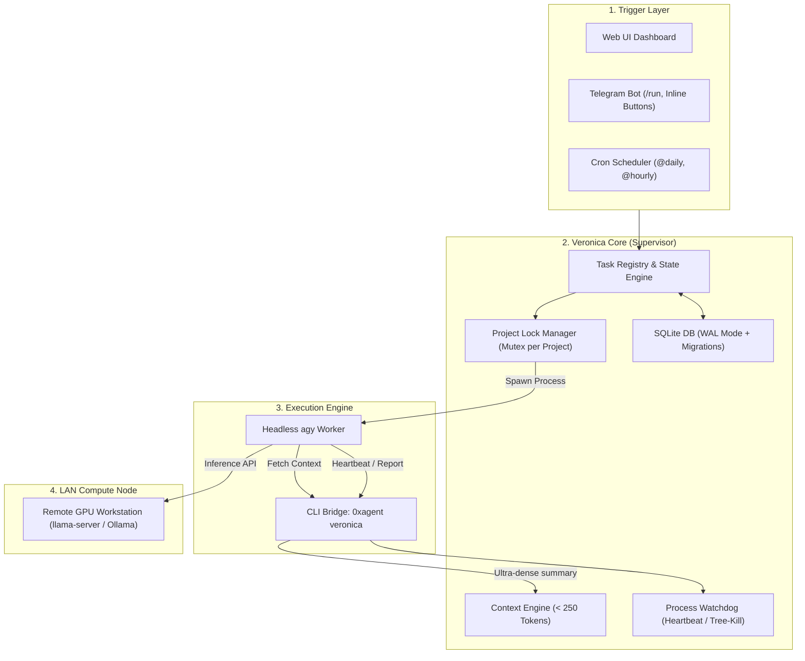

# Module «Veronica» (Вероника) — Autonomous AI Assistant & Supervised Agent Orchestrator

## 🚀 Overview
**Module Veronica** is a 24/7 autonomous background AI supervisor, persistent state machine, and agent orchestrator built into the **0xAgent** platform. It acts as an executive command center that monitors projects, coordinates headless agents (`agy`), enforces safety constraints, manages LAN GPU inference delegation, and connects directly to Telegram.

---

## 🏛 Architecture & Key Subsystems



---

## 🔑 Key Capabilities

### 1. Headless Agent Spawner (`agy`)
* **Verified CLI Flags**:
  ```bash
  agy --print "<prompt>" --dangerously-skip-permissions --output-format json --project "<project>"
  ```
* **Environment Variable Injection**:
  - `VERONICA_TASK_ID`: Unique UUID of active task.
  - `VERONICA_TASK_TOKEN`: Cryptographic single-use nonce.
  - `VERONICA_PROJECT`: Bound project name.
  - `VERONICA_API_URL`: Local REST bridge endpoint.

### 2. Dense Context Engine (< 250 Tokens)
* Instead of re-reading massive project directories, agents query Veronica:
  ```bash
  0xagent veronica context <project> --task <id>
  ```
* Produces ultra-compact token-efficient state:
  `PROJECT:0xAgent | AUTONOMY:L2 | RECENT_TASKS:[health_check:completed] | COMMITS:[b0be1d6:"fix telegram"] | RULES:keep_minimal`

### 3. Telegram Gateway & Awaiting Approval
* **Safe HTML Mode**: Full support for Telegram Bot API formatting (`parse_mode: 'HTML'`) with automatic entity escaping.
* **Commands**:
  - `/start`, `/help` — Overview and display caller's Telegram ID.
  - `/status` — System telemetry, active tasks, remote GPU node status.
  - `/projects` — Project summaries and active counts.
  - `/today`, `/yesterday` — Chronological daily activity audit.
  - `/run <skill> <project>` — Spawn autonomous agent task.
  - `/kill <task_id>` — Force kill stuck agent.
* **Interactive Inline Approval**:
  - In `awaiting_approval` state, bot renders `[✅ Approve]` and `[❌ Reject]` buttons.
  - Callback queries unblock execution instantly upon user click.

### 4. 10 Built-In Production Skills (`server/veronica/skills/`)

| Skill File | Purpose |
|---|---|
| `code_review.md` | Automated code quality, type-safety, and style review. |
| `security_audit.md` | Scans for SQLi, XSS, RCE, secret leaks, and dependency advisories. |
| `health_check.md` | Verifies build compilation and 100% test pass rate. |
| `git_sync.md` | Safe branch synchronization and commit tracking. |
| `architecture_audit.md` | Deep modularity analysis and circular dependency check. |
| `refactoring.md` | Eliminates dead code and duplication under strict test validation. |
| `test_generator.md` | Generates complete unit/integration tests with edge cases. |
| `doc_sync.md` | Synchronizes English and Russian documentation in 1-to-1 parity. |
| `dependency_updater.md` | Safe minor/patch npm package updates without regressions. |
| `incident_responder.md` | Crash diagnosis, stacktrace analysis, and remediation patches. |

### 5. Remote Compute Node (LAN Workstation Offloading)
* Allows a lightweight laptop to run 24/7 with minimal power draw while delegating heavy LLM token generation to a LAN PC with a dedicated GPU.
* Configurable under **Settings -> Local Server -> Compute Node (LAN)**.

### 6. Fault Tolerance, Migrations & Retention
* **Schema Migrations (`schema_migrations`)**: Incremental SQLite migrations.
* **Database Backups**: Automatic daily backups (`veronica_backup_YYYY-MM-DD.db`) with 30-day retention and WAL checkpoints.
* **Log Rotation**: Size-based rotated logs (`10 MB x 5 archives`) in `~/.0xagent/veronica/logs/`.
* **Process Watchdog**: Heartbeat tracking with automatic recursive Tree-Kill on timeout (>180s).
* **Startup Reconciliation**: Detects dead PIDs on server reboot and clears dangling locks.

---

## 🛠 Veronica CLI Quick Reference

```bash
0xagent veronica context <project> [--task <id>]   # Fetch compact project context
0xagent veronica heartbeat --task <id>             # Send heartbeat ping
0xagent veronica report --task <id> --status ...   # Record task outcome
0xagent veronica list                              # List active tasks
```
