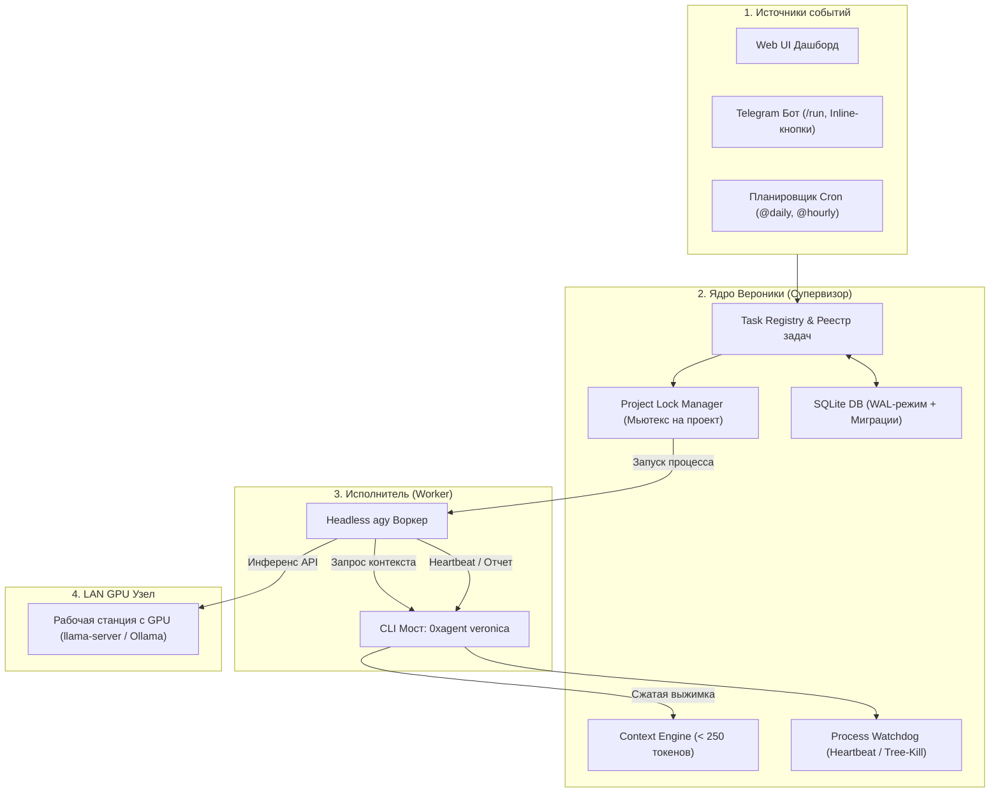

# Модуль «Вероника» (Veronica) — Автономный AI-ассистент и супервизор распределенных агентов

## 🚀 Обзор
**Модуль «Вероника»** — это встроенный в платформу **0xAgent** автономный фоновый супервизор, механизм долговременного состояния (Persistent State Machine) и координатор фоновых агентов (`agy`), работающий 24/7. Модуль выступает командным центром: отслеживает состояние проектов, управляет блокировками, делегирует инференс по локальной сети (LAN GPU Node) и взаимодействует с разработчиком через Telegram.

---

## 🏛 Архитектура и ключевые подсистемы



---

## 🔑 Ключевые возможности

### 1. Headless Запуск Агентов (`agy`)
* **Проверенные флаги CLI**:
  ```bash
  agy --print "<prompt>" --dangerously-skip-permissions --output-format json --project "<project>"
  ```
* **Инъекция переменных окружения**:
  - `VERONICA_TASK_ID`: UUID активной задачи.
  - `VERONICA_TASK_TOKEN`: Одноразовый криптографический токен.
  - `VERONICA_PROJECT`: Имя целевого проекта.
  - `VERONICA_API_URL`: Локальный REST эндпоинт моста.

### 2. Сверхплотный контекстный движок (< 250 токенов)
* Вместо повторного чтения всего репозитория агент запрашивает выжимку у Вероники:
  ```bash
  0xagent veronica context <project> --task <id>
  ```
* Результат:
  `PROJECT:0xAgent | AUTONOMY:L2 | RECENT_TASKS:[health_check:completed] | COMMITS:[b0be1d6:"fix telegram"] | RULES:keep_minimal`

### 3. Telegram Шлюз и Согласование Действий (Awaiting Approval)
* **Безопасный HTML-режим**: Полная поддержка форматирования Bot API (`parse_mode: 'HTML'`) с экранированием сущностей.
* **Команды бота**:
  - `/start`, `/help` — Обзор и отображение Telegram ID пользователя.
  - `/status` — Телеметрия, активные задачи, статус LAN GPU ноды.
  - `/projects` — Список и сводка проектов.
  - `/today`, `/yesterday` — Суточный отчет о выполненной работе.
  - `/run <skill> <project>` — Запуск автономного агента.
  - `/kill <task_id>` — Принудительная остановка зависшей задачи.
* **Интерактивные Inline-кнопки**:
  - В статусе `awaiting_approval` бот отправляет кнопки `[✅ Одобрить]` и `[❌ Отклонить]`.
  - Callback Query мгновенно снимает задачу с паузы при нажатии.

### 4. Каталог из 10 Встроенных Навыков (`server/veronica/skills/`)

| Файл навыка | Назначение |
|---|---|
| `code_review.md` | Автоматический аудит читаемости, типизации и качества кода. |
| `security_audit.md` | Поиск SQLi, XSS, RCE, утечек секретов и уязвимостей в пакетах. |
| `health_check.md` | Проверка сборки, компиляции и 100% прохождения тестов. |
| `git_sync.md` | Безопасная синхронизация веток и отслеживание коммитов. |
| `architecture_audit.md` | Анализ модульных границ и циклических зависимостей. |
| `refactoring.md` | Устранение дублирования и мертвого кода под контролем тестов. |
| `test_generator.md` | Автоматическая генерация тестов под `node:test`. |
| `doc_sync.md` | Синхронизация документации между `README.md` и `README.ru.md`. |
| `dependency_updater.md` | Безопасное обновление minor/patch зависимостей. |
| `incident_responder.md` | Анализ стектрейсов сбоев, воспроизведение и создание патчей. |

### 5. Удаленный GPU Узел (Compute Node LAN)
* Позволяет ноутбуку работать 24/7 с минимальным энергопотреблением, делегируя генерацию токенов на основной ПК с мощной видеокартой.
* Настраивается в **Настройки -> Local Server -> Compute Node (LAN)**.

### 6. Интеграция с Экосистемой Antigravity & Селектор Моделей
* **Движок Antigravity CLI (`agy`)**: Запуск автономных фоновых агентов и многошаговых диалогов с автоматической валидацией параметров.
* **Интеллектуальный Резолвер Моделей и Рассуждений (`resolveAntigravityModelAndEffort`)**:
  - `gemini-3.7-flash` и `gemini-3.6-flash`: Настраиваемый уровень рассуждений (`low` [по умолчанию], `medium`, `high`).
  - `gemini-3.1-pro`: Настраиваемый уровень рассуждений (`low` [по умолчанию], `high`).
  - `claude-sonnet-4-6` и `claude-opus-4-6-thinking`: Автоматическое отсечение флага `--effort` (встроенный Thinking).
  - `gpt-oss-120b-medium`: Фиксированный режим рассуждений (без флага `--effort`).
  - Локальные GGUF модели (`llama.cpp`): Инлайн-переключатель рассуждений (`off`, `low`, `medium`, `high`).
* **Безопасный Запуск Процессов**: Прямой вызов через `getSafeCliPath` с `shell: false` (полное устранение предупреждений Node.js `DEP0190`).
* **Специализированные Субагенты**: Поддержка флага `--agent` (`critic`, `research`, `layout-qa-accessibility`, `ux-psychology-designer`, `multi-agent-orchestrator`).

### 7. Операционный Журнал и Многошаговый Диалог в Telegram
* **Операционный Журнал (SQLite WAL Миграция v3)**: Постоянный реестр всех событий, этапов задач и действий для мгновенного управленческого аудита.
* **Шорткоды Суточных Отчетов**: Быстрый вызов сводок в Telegram и Web-IDE:
  - `/today` / `Alt+2` — Сводка выполненных действий за сегодня.
  - `/yesterday` / `Alt+3` — Подробный отчет за вчерашний день.
  - `/tasks` / `Alt+4` — Список активных и недавних задач.
* **Сохранение Контекста Диалога**: Полная поддержка многошагового контекста в Telegram и Web-IDE с авто-привязкой проекта и сбросом (`/reset`).
* **Структурированные 4-Фазные Промпты (`taskPromptBuilder`)**: Автономные агенты автоматически получают паспорт проекта, стандарты кода и правила безопасности.

### 8. Интеграция с Web-IDE (`VeronicaActionStrip` & `VeronicaTaskModal`)
* **Панель Быстрых Действий**: Стильная панель в теме Graphite с горячими клавишами (`Alt+1..5`) прямо над строкой ввода.
* **Интерактивное Окно Постановки Задач**: Модальное окно с выбором проекта, навыка, уровня автономии (L0–L5) и кастомных инструкций.

### 9. Потоковый SSE & WebSocket Стриминг Ответов
* **Server-Sent Events (SSE)**: Эндпоинт `GET /api/veronica/tasks/:id/stream` передает live stdout/stderr чанки в реальном времени.
* **WebSocket Fallback**: Рассылка событий `veronica-stream-chunk` и `veronica-task-status` всем подключенным клиентам.
* **Интерактивная Консоль**: Просмотр логов в реальном времени с auto-scroll, очисткой и копированием в буфер.

### 10. Изолированная Архитектура & Graceful Hot-Reload
* **Модульная Изоляция**: База данных SQLite в режиме WAL (`~/.0xagent/veronica/veronica.db`) с асинхронной очередью записи `writeQueue`.
* **Graceful Hot-Reload (`POST /api/veronica/reload`)**: Бесшовная горячая перезагрузка БД, watchdog и планировщика без прерывания работы родительского сервера 0xAgent и локальных LLM сессий.
* **Отказоустойчивость & Watchdog**: Проверка PID в таблице процессов ОС, рекурсивный tree-kill и авто-восстановление после сбоев.

---

## 🛠 Быстрый справочник по CLI Вероники

```bash
0xagent veronica context <project> [--task <id>]   # Получить плотный контекст проекта
0xagent veronica heartbeat --task <id>             # Отправить heartbeat пинг
0xagent veronica report --task <id> --status ...   # Зафиксировать итог задачи
0xagent veronica list                              # Список активных задач
```
